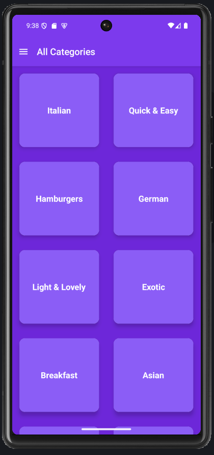
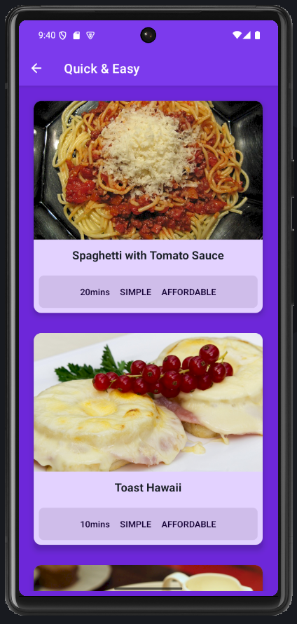
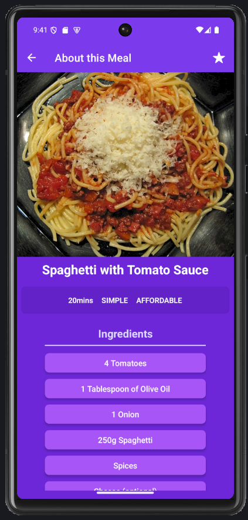
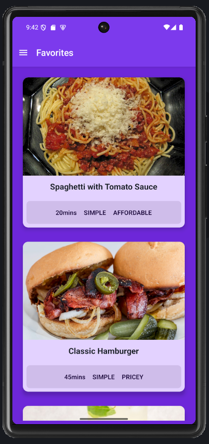

# 🍽️ Meals App

A modern and elegant React Native mobile application for discovering and managing your favorite meals. Built with Expo, React Navigation, and Redux Toolkit, this app provides an intuitive interface for browsing meal categories, viewing detailed recipes, and managing your personal favorites collection.

## 📱 Screenshots

### Categories Screen



_Browse through various meal categories including Italian, Asian, Vegan, Desserts, and more._

### Meals Overview Screen



_View all meals within a selected category with beautiful card layouts._

### Meal Detail Screen



_Detailed recipe view with ingredients, cooking steps, and nutritional information._

### Favorites Screen



_Manage and access your favorite meals in one convenient location._

## ✨ Features

- **🏠 Categories Navigation**: Browse meals by categories like Italian, Asian, Vegan, Desserts, etc.
- **📋 Detailed Recipes**: View comprehensive meal information including:
  - High-quality food images
  - Cooking time and difficulty level
  - Complete ingredients list
  - Step-by-step cooking instructions
  - Dietary information (Vegan, Vegetarian, Gluten-free, etc.)
- **⭐ Favorites Management**: Save and manage your favorite meals with Redux state management
- **🎨 Modern UI/UX**: Beautiful purple-themed design with smooth animations
- **📱 Responsive Design**: Optimized for various screen sizes
- **🗂️ Drawer Navigation**: Easy access to different sections of the app

## 🛠️ Tech Stack

- **Framework**: React Native (0.79.5)
- **Development Platform**: Expo (~53.0.17)
- **State Management**: Redux Toolkit (@reduxjs/toolkit)
- **Navigation**: React Navigation v7
  - Native Stack Navigator
  - Drawer Navigator
- **UI Components**: React Native built-in components
- **Icons**: Expo Vector Icons (@expo/vector-icons)

## 📦 Dependencies

```json
{
  "@react-navigation/drawer": "^7.5.3",
  "@react-navigation/native": "^7.1.14",
  "@react-navigation/native-stack": "^7.3.21",
  "@reduxjs/toolkit": "^2.8.2",
  "expo": "~53.0.17",
  "expo-status-bar": "~2.2.3",
  "react": "19.0.0",
  "react-native": "0.79.5",
  "react-native-gesture-handler": "~2.24.0",
  "react-native-reanimated": "~3.17.4",
  "react-native-safe-area-context": "5.4.0",
  "react-native-screens": "~4.11.1",
  "react-redux": "^9.2.0"
}
```

## 🚀 Getting Started

### Prerequisites

- Node.js (v16 or higher)
- npm or yarn
- Expo CLI
- Android Studio (for Android development)
- Xcode (for iOS development - macOS only)

### Installation

1. **Clone the repository**

   ```bash
   git clone https://github.com/aaronersando/Meals-App.git
   cd MealsApp
   ```

2. **Install dependencies**

   ```bash
   npm install
   # or
   yarn install
   ```

3. **Start the development server**

   ```bash
   npm start
   # or
   yarn start
   ```

4. **Run on your preferred platform**

   ```bash
   # For Android
   npm run android

   # For iOS
   npm run ios

   # For Web
   npm run web
   ```

## 📁 Project Structure

```
MealsApp/
├── components/
│   ├── CategoryGridTile.js
│   ├── MealDetails.js
│   ├── MealDetail/
│   │   ├── Icon.js
│   │   ├── List.js
│   │   └── Subtitle.js
│   └── MealsList/
│       ├── MealItem.js
│       └── MealsList.js
├── data/
│   └── dummy-data.js
├── models/
│   ├── category.js
│   └── meal.js
├── screens/
│   ├── CategoriesScreen.js
│   ├── FavoritesScreen.js
│   ├── MealDetailScreen.js
│   └── MealsOverviewScreen.js
├── store/
│   ├── context/
│   │   └── favorites-context.js
│   └── redux/
│       ├── favorites.js
│       └── store.js
├── assets/
│   └── [app icons and screenshots]
├── App.js
└── package.json
```

## 🎨 Design Features

- **Modern Purple Theme**: Cohesive color scheme throughout the app
- **Smooth Animations**: Enhanced user experience with React Native Reanimated
- **Card-based Layout**: Clean and modern meal presentation
- **Intuitive Navigation**: Easy-to-use drawer and stack navigation
- **High-Quality Images**: Beautiful food photography from Unsplash
- **Responsive Cards**: Adaptive layouts for different screen sizes

## 🔧 Available Scripts

- `npm start` - Start the Expo development server
- `npm run android` - Run on Android device/emulator
- `npm run ios` - Run on iOS device/simulator
- `npm run web` - Run in web browser

## 🤝 Contributing

1. Fork the repository
2. Create your feature branch (`git checkout -b feature/AmazingFeature`)
3. Commit your changes (`git commit -m 'Add some AmazingFeature'`)
4. Push to the branch (`git push origin feature/AmazingFeature`)
5. Open a Pull Request

## 📄 License

This project is licensed under the MIT License - see the [LICENSE](LICENSE) file for details.

## 👨‍💻 Author

**Aaron Ersando**

- GitHub: [@aaronersando](https://github.com/aaronersando)
- Project: [Meals-App](https://github.com/aaronersando/Meals-App)

## 🙏 Acknowledgments

- Images provided by [Unsplash](https://unsplash.com)
- Icons by [Expo Vector Icons](https://docs.expo.dev/guides/icons/)
- Built with [React Native](https://reactnative.dev/) and [Expo](https://expo.dev/)

---

⭐ **Star this repository if you found it helpful!**
